# Tank - 坦克大战 (Battle City)

## 项目愿景

经典 FC 风格网页坦克大战游戏。使用原生 Canvas API 与 ES6 模块化架构实现，零外部依赖，单 HTML 文件即可运行。支持玩家操作、多种敌人 AI、障碍物系统、爆炸粒子特效、道具系统、程序化音频与难度递增的无尽模式。

## 架构总览

- **技术栈**: 原生 JavaScript (ES6 Modules) + Canvas 2D API + HTML/CSS
- **架构模式**: 面向对象经典架构，实体-管理器分层
- **渲染引擎**: Canvas 2D（`requestAnimationFrame` 驱动游戏循环）
- **构建工具**: 无（直接浏览器加载 ES Module）
- **代码量**: 约 2100 行，23 个源文件

### 核心设计

1. **Game 主控制器** (`js/Game.js`) -- 游戏循环、状态管理、碰撞分发、渲染调度
2. **实体层** (`js/entities/`) -- Entity 基类 -> Tank -> Player/Enemy/HeavyEnemy/FastEnemy，Bullet、Obstacle、Particle、PowerUp 及效果子类
3. **管理器层** (`js/managers/`) -- 输入管理、碰撞检测、敌人生成、地图生成、道具管理、音频管理、分数与排行榜、UI 管理
4. **工具层** (`js/utils/`) -- 常量配置、几何/随机工具函数

## 模块结构图

```mermaid
graph TD
    ROOT["tank (项目根)"] --> HTML["index.html"]
    ROOT --> CSS["css/"]
    ROOT --> JS["js/"]

    CSS --> STYLE["style.css"]

    JS --> GAME["Game.js (主控制器)"]
    JS --> ENT["entities/ (实体层)"]
    JS --> MGR["managers/ (管理器层)"]
    JS --> UTL["utils/ (工具层)"]

    ENT --> E_ENTITY["Entity.js (基类)"]
    ENT --> E_TANK["Tank.js (坦克基类)"]
    ENT --> E_PLAYER["Player.js"]
    ENT --> E_ENEMY["Enemy.js"]
    ENT --> E_HEAVY["HeavyEnemy.js"]
    ENT --> E_FAST["FastEnemy.js"]
    ENT --> E_BULLET["Bullet.js"]
    ENT --> E_OBS["Obstacle.js"]
    ENT --> E_PART["Particle.js"]
    ENT --> E_POWERUP["PowerUp.js"]
    ENT --> E_FX["effects/ (效果子类)"]

    MGR --> M_INPUT["InputManager.js"]
    MGR --> M_COLL["CollisionManager.js"]
    MGR --> M_SPAWN["SpawnManager.js"]
    MGR --> M_MAP["MapGenerator.js"]
    MGR --> M_POWERUP["PowerUpManager.js"]
    MGR --> M_AUDIO["AudioManager.js"]
    MGR --> M_SCORE["ScoreManager.js"]
    MGR --> M_UI["UIManager.js"]

    UTL --> U_CONST["constants.js"]
    UTL --> U_HELP["helpers.js"]

    click ENT "./js/entities/CLAUDE.md" "查看 entities 模块文档"
    click MGR "./js/managers/CLAUDE.md" "查看 managers 模块文档"
    click UTL "./js/utils/CLAUDE.md" "查看 utils 模块文档"
```



## 模块索引

| 模块路径 | 语言 | 职责 | 文件数 | 入口文件 |
|---------|------|------|-------|---------|
| `js/entities/` | JavaScript | 游戏实体（玩家、敌人、子弹、障碍物、粒子、道具及效果） | 14 | `Entity.js` (基类) |
| `js/managers/` | JavaScript | 管理器（输入、碰撞、生成、地图、道具、音频、分数、UI） | 8 | 各自独立 |
| `js/utils/` | JavaScript | 常量配置与工具函数 | 2 | `constants.js` |

## 运行与开发

### 启动方式

本项目无构建步骤，需要通过 HTTP 服务器加载 ES Module：

```bash
# 方式一：Python 内置服务器
python -m http.server 8080

# 方式二：Node.js npx
npx serve .

# 方式三：VS Code Live Server 插件
# 右键 index.html -> Open with Live Server
```

然后在浏览器打开 `http://localhost:8080`。

### 操作说明

| 按键 | 功能 |
|-----|------|
| W / ArrowUp | 向上移动 |
| S / ArrowDown | 向下移动 |
| A / ArrowLeft | 向左移动 |
| D / ArrowRight | 向右移动 |
| Space | 发射子弹 |
| R | 游戏结束后重新开始 |
| ESC | 暂停/恢复（VS Code 伪装） |

### 游戏规则

- 画布 680x680 像素，17x17 网格（每格 40px）
- 玩家初始位于左下角
- 敌人从顶部三个生成点（左上、中上、右上）随机出现，含普通、重装（2HP）、快速三种类型
- 障碍物：砖块（可破坏）、钢块（不可破坏）、河流（不可通行）、森林（可隐藏）、基地（底部中心，需保护）
- 击毁普通敌人 +100 分，重装敌人 +200 分，快速敌人 +150 分
- 道具系统：加速、速射、护盾三种道具随机生成
- 敌人 AI 随时间增强（生成间隔从 3s 递减到 1s）
- 同屏敌人上限 6 个
- 玩家被击中或基地被摧毁均导致游戏结束
- ESC 键触发 VS Code 伪装暂停界面
- 排行榜使用 localStorage 持久化，最多保留 20 条记录
- 进入前三名时显示庆祝动画与祝贺文字
- BGM 场景自动切换：游戏开始播放经典战斗音乐，90 秒后切换激烈战斗音乐，Boss 出现时切换 Boss 战专属音乐

## 测试策略

当前项目**无自动化测试**。根据开发计划（`.zcf/plan/current/坦克大战游戏.md`），测试阶段（阶段 7）尚未完成，标记为待办。

建议的测试方向：
- 实体碰撞边界条件测试
- AI 决策逻辑单元测试
- 地图生成覆盖率验证
- 分数/排行榜持久化与排序正确性

## 编码规范

- **模块化**: ES6 `import/export`，每个类一个文件
- **命名**: 类使用 PascalCase，函数/变量使用 camelCase，常量使用 UPPER_SNAKE_CASE
- **注释**: JSDoc 风格的方法注释，关键逻辑有中文行内注释
- **实体继承链**: `Entity` -> `Tank` -> `Player`/`Enemy`/`HeavyEnemy`/`FastEnemy`，通过 `markedForDeletion` 标记清理
- **碰撞检测**: 统一使用 AABB 矩形相交检测（`rectIntersect`）
- **方向系统**: 数值编码 0=UP, 1=RIGHT, 2=DOWN, 3=LEFT
- **分数多态**: 各敌人子类实现 `getScore()` 方法，`ScoreManager.addKill(enemy)` 通过多态获取分值

## AI 使用指引

- 修改游戏参数（速度、冷却、密度等）请编辑 `js/utils/constants.js`
- 添加新实体类型需继承 `Entity` 基类，实现 `update()` 和 `draw()` 方法
- 添加新障碍物类型在 `Obstacle.draw()` 中增加绘制分支
- AI 行为调整在 `Enemy.makeDecision()` 中修改概率权重
- 地图生成逻辑在 `MapGenerator` 的静态方法中
- 碰撞检测新增类型需在 `Game.handleCollisions()` 和 `CollisionManager` 中同步添加
- UI 显示/隐藏逻辑集中在 `UIManager`，不直接操作 DOM
- 排行榜数据格式与存储逻辑在 `ScoreManager`

## 变更记录 (Changelog)

| 日期 | 操作 | 说明 |
|------|------|------|
| 2026-05-01 | BGM 切换功能 | AudioManager 支持多曲目场景自动切换（经典/激烈/Boss 战），新增游戏规则说明 |
| 2026-04-19 | 增量更新 | 新增 UIManager/ScoreManager 描述；更新文件数(21->23)、同屏上限(4->6)、Mermaid 图、模块索引 |
| 2026-04-04 | 初始化 AI 上下文 | 首次生成 CLAUDE.md、模块文档与 index.json |
